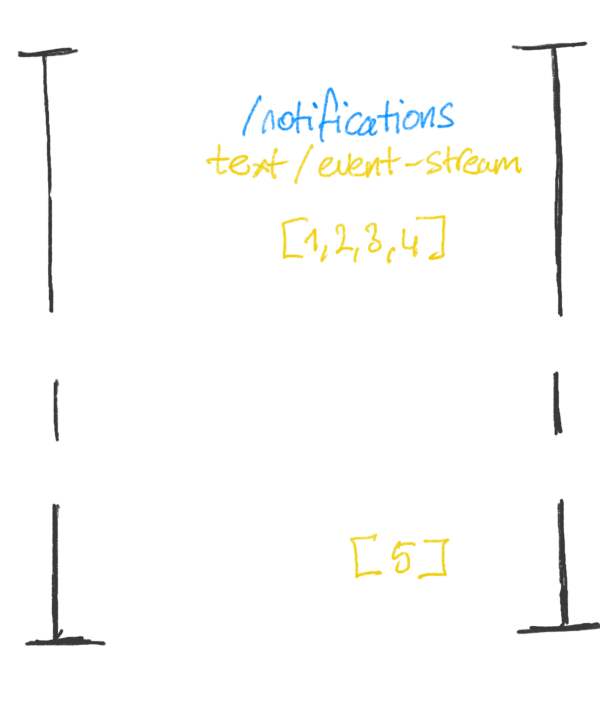
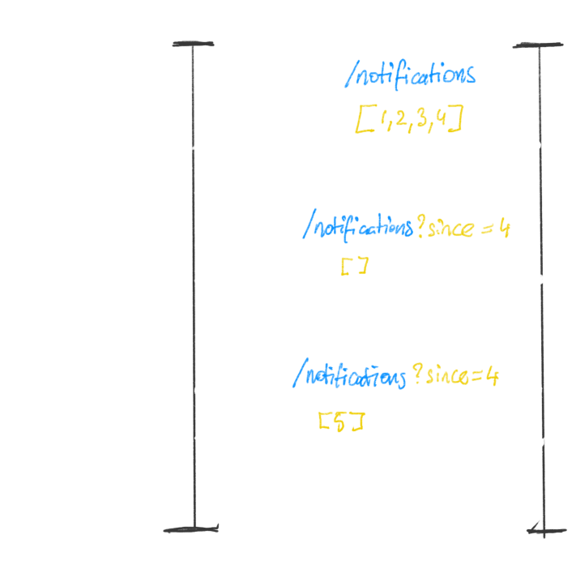

# `whois` "Tasos Bitsios"

{.float-right}

- Long time listener, first time speaker

. . .

- Full stack software developer ~ 13 years
  - Somwehat backend-leaning
  - Mostly JS/TS/node.js/React
  - Mostly worked in startups

. . .

- Developer @ [Kadena](https://kadena.io/) Developer Experience team

{.w32} [Takadenoshi](https://github.com/takadenoshi) 

{.w28} [\@Takadenoshi](https://x.com/takadenoshi)


# `whois` "Kadena"

{.float-right}

- Scalabe PoW Blockchain

. . .

- Focus on:
  - Scalability
  - Secure smart contracts
    - Formal verification
    - Source available

- DX Team
  - Enable and empower our ecosystem developers

{.w32} [Kadena-io](https://github.com/kadena-io) & [Kadena-community](https://github.com/kadena-community)

{.w28} [\@Kadena_io](https://x.com/kadena_io) &middot; 🌐 [https://kadena.io](https://kadena.io)


---

<div class="abs-centered big-font">
## SSE?
</div>

---


# Server-Sent Events (SSE)

{.float-right}

- Essentially a streaming GET
  - Server writes more data as it becomes available

. . .

- Unidirectional
  - Server -> Client

. . .

- UTF-8 only

. . .

- Reconnection batteries included
  - Terms and conditions may apply

---

# Like polling but better

Best suited for UTF-8 updates

. . .

Especially for multiple update channels

---

# Polling vs SSE

{.float-right}



---

# Like WebSockets but -

- Unidirectional & UTF-8

. . .

- Easy to debug
  - just `curl` it ✅

. . .

- Is HTTP/REST -> easier integrated
  - Happy part of your RESTful server backend
    - vs WS the trying-to-fit-in cousin

. . .

- Easier for third parties & exotic networks (?)

. . .

- WS seems overkill for unidirectional
  - But if it works for you 👍

---

# Use cases: Async job progress

<div class="centered"></div>

---

# Use cases: Real-time ticker data

<div class="centered"></div>

---

# Use cases: Notifications

<div class="centered"></div>

---

# Can I use?

Yes (96.11%)


[caniuse.com/eventsource](https://caniuse.com/eventsource)

---

# What is this ~~new~~ thing?

:::::::::::::: {.columns}
::: {.column width="40%"}

## Old enough to vote

🥳 SSE is 19 years old

🔧 13 years of mainstream support

Originally by Ian Hickson, while at Opera

:::
::: {.column width="60%"}

## Timeline

- 2004 &middot; [Server-sent DOM Events](https://web.archive.org/web/20041009144718/http://www.whatwg.org/specs/web-apps/current-work/#server-sent), Ian Hickson, Opera Software, WHATWG Web Applications 1.0
- 2006 &middot; [Production] Opera browser implementation
- 2009 &middot; [W3C Working Draft](https://www.w3.org/TR/2009/WD-eventsource-20090423/), Ian Hickson, Google Inc
- 2010 &middot; [Production] Safari v5, Chrome v6
- 2011 &middot; [Production] Firefox v6, 
- 2015 &middot; [W3C Recommendation](https://www.w3.org/TR/2015/REC-eventsource-20150203/)

[W3C Publication History](https://www.w3.org/TR/2015/REC-eventsource-20150203/) &middot; [HTML Living Standard § 9.2](https://html.spec.whatwg.org/multipage/server-sent-events.html#server-sent-events) 


:::
::::::::::::::

---

# Largely overlooked: Google Trends

<div class="centered"> {.full-width} </div>

---

# Largely overlooked: StackOverflow

:::::::::::::: {.columns}
::: {.column width="33%"}

## SSE Tags


:::
::: {.column width="33%"}

## Polling Tags


:::
::: {.column width="33%"}

## Websocket Tags


:::
::::::::::::::

---

# Largely overlooked: why?

Contemporary to Web sockets, HTML5, `<video>`, Web workers, Web storage

Narrower use case

:::::::::::::: {.columns}
::: {.column width="66%"}


[Ian Hickson Resume](http://ian.hixie.ch/career/resume.html)

:::
::: {.column width="auto"}


:::
::::::::::::::

---

<div class="abs-centered big-font">
## Show me the `<>`
</div>

---

# Minimum Viable SSE response


The simplest server-sent event stream specifies just `data` events.

```
> GET /stream/hello HTTP/1.1

< HTTP/1.1 200 OK
< Content-Type: text/event-stream

< data: Hello\n\n

< data: ReactLive are you there?\n\n
```

. . .

Events separated by two newline characters `\n\n`

Data is encoded in UTF-8 (mandatory)

<sup>[Playground](https://github.com/takadenoshi/sse-presentation): "simple" scenario</sup>

---

# Simple EventSource consumer

Server-sent events are consumed with `EventSource`:

```{.javascript .numberLines}
let i=0;

const source = new EventSource("http://localhost:3001/stream/simple");

// "message" event emitted for each "data" event received
source.addEventListener("message", event => console.log(++i, event.data), false);

// or .onmessage = (...) if that is your jam

```

. . .

:::::::::::::: {.columns}
::: {.column width="50%"}

```
< HTTP/1.1 200 OK
< Content-Type: text/event-stream

< data: Hello\n\n

< data: ReactLive are you there?\n\n
```

:::
::: {.column width="50%"}

```


1 Hello

2 ReactLive are you there?
```

:::
::::::::::::::

---

# Interactive part - scan me!

{.float-right}

Scan the QR to interact with this presentation directly

. . .

Demo app:

- Emote with 💖 👍 🎉 👏 😂 😲 🤔 👎
- See SSE data
- Link to SSE experiments playground & presentation

. . .

Bottom right corner:

- Reaction emoji fountain
- Connection status 🔌
- Number of streaming clients
- QR again (you can scan later)

---

# Named Events

You can "namespace" your events using the `event` field with any custom name:

```
< event: goal
< data: "ARS-LIV 1-1 45"\n\n

< event: spectator-chat
< data: "Did you see that ludicrous display just now"\n\n
```

. . .

The `goal` and `spectator-chat` events are handled separately on the frontend

- Allows multiplexing / routing events 
  - no need for pattern matching on a shared data payload

---

# Events: Live Demo

In the live reactions demo, we stream two types of things:

- `clients` event: number of clients
- `data` event: list of emoji enum values (1-8)

```
< event: clients
< data: 10

< data: [1,2,3,4]
```

---

# Reconnection (1)

EventSource consumers will reconnect* if the connection is interrupted.

Default reconnection timeout ~ 3-5 s.

<sup>\* _with implementation-specific caveats_</sup>

---

# Reconnection (2) - Custom timeouts

The reconnection timeout can be customized.

Emit a `retry:` field in any of the events:

```
< retry: 2500
< data: Hello!\n\n
```

- Value is in milliseconds
- Timeouts are linear

<sup>[Playground](https://github.com/takadenoshi/sse-presentation): "Retry-flaky" scenario</sup>

---

# Reconnection (3) - Last-Event-ID

Events can include an `id` field with any UTF-8 string as value

. . .

Connection interrupted? Sets reconnection header `Last-Event-ID: x`

```
< id: data-0
< retry: 5000
< data: Data Zero event\n
```

💔 **Disconnects**

➡️  _5 seconds later_

```
> GET /stream/notifications HTTP/1.1
> Last-Event-ID: data-0
```

<sup>[Playground](https://github.com/takadenoshi/sse-presentation): "notifications" scenario</sup>

---

# Comments

Any lines starting with `:` (colon)

```
< :TODO emit some events in the near future
```

These are ignored on the client-side

---

# Full SSE response

:::::::::::::: {.columns}
::: {.column width="45%"}

Entire SSE gramar: 4+1 fields

- Setting reconnection time `retry: 2000`
- Event identifiers `id: 0`
- Unnamed events `data: Hello\n\n`
- Comment: starts with colon `:I am a ...`
- Named events `event: status`


:::
::: {.column width="55%"}

```{.numberLines}
> GET /stream/hello HTTP/1.1

< HTTP/1.1 200 OK
< Content-Type: text/event-stream

< retry: 2000
< id: 0
< data: {"message":"Hello"}\n\n

< :I am a comment line

< id: 1
< event: status
< data: {"warn":"Service degraded"}\n\n
```

:::
::::::::::::::

---

# EventSource: custom events

You can subscribe to custom events with `.addEventListener`:

```{.javascript .numberLines}
const source = new EventSource('/stream/hello');

// [name]: triggers for custom named event, here: "status"
source.addEventListener(
  "status",
  ({ data }) => console.log("custom event: status", JSON.parse(data)),
  false,
);

// as before, unnamed data events
source.addEventListener(
  "message", 
  (event) => { console.log("data event", event.data); },
  false,
);
```

---

# EventSource: connection events

Subscribe to `open` and `error` for connection management:

```{.javascript .numberLines}
// on connection established
source.addEventListener(
  "open",
  (event) => { console.log("Connection opened"); },
  false
);

// on disconnection
source.addEventListener(
  "error",
  (event) => { console.log("Connection error"); },
  false
);
```

---

# The EventSource Interface

- `constructor(url, { withCredentials: boolean })`
  - `withCredentials`: instantiate with CORS credentials (default: false)
- Events: `open` | `error` | `message` | `<custom-name>`
  - addEventListener, onmessage, onerror, ...
- `close()`
- `readyState`: State <u>intent</u> enum: `CONNECTING` (0) | `OPEN` (1) | `CLOSED`(2)
  - CONNECTING: also "waiting to reconnect"
  - CLOSED: will not attempt to reconnect

---

<div class="abs-centered">
<div class="big-font">
## To be clear
</div>

I hold no $SSE stock
</div>

---

<div class="abs-centered big-font">
## SSE NFTs

. . .

will not 

be made

available
</div>

---

# ~~You should definitely use it~~

. . .

## You should definitely know about it

Warts and all

---

<div class="abs-centered">
<div class="big-font">
## Considerations
</div>
I ate some dog food for ~~you~~ science
</div>

---

# Error event is a bit useless

- Single bit of information: "error"

- callback signature is `(event: Event) => void`
  - `event.target` is instanceof `EventSource`
  - no reason / message / code

- Some disconnections can be "fatal", cancelling the reconnection policy

- Inspect `readyState` to find out EventSource's intent:
  - CONNECTING: will reconnect / waiting to reconnect / reconnecting
  - CLOSED: will not reconnect

---


# Implementation Considerations: HTTP/1.1

## HTTP/1.1 connections quota

Max number of connections: 6

. . .

Per-hostname quota

Browser-wide enforcement (shared by all tabs)

Too much SSE without planning -> choke

::: notes
[MDN](https://developer.mozilla.org/en-US/docs/Web/API/Server-sent_events/Using_server-sent_events#listening_for_custom_events) [StackOverflow](https://stackoverflow.com/questions/5195452/websockets-vs-server-sent-events-eventsource/5326159)
:::

---

# Implementation Considerations: HTTP/1.1

## Possible Solutions


- **Prefer HTTP/2 where available** (can-i-use 96% yes)
  - max number of [simultaneous HTTP streams](https://developer.mozilla.org/en-US/docs/Web/API/Server-sent_events/Using_server-sent_events#listening_for_custom_events) is negotiated (defaults to 100)
  
. . .

- Use an EventSource within a SharedWorker
  - Used by all tabs
  - Applicable for global streams
  
. . .

- Use subdomains for SSE endpoint(s)
  - Each subdomain -> another 6 connection threads
  - Global HTTP/1.1 browser limits apply (~20)
      - Don't overdo it 

---

# Implementation Considerations: Reconnecting

## Different Browser Implementations

When a network error is encountered:

- Firefox: Will **stop** retrying (standard compliant)
- Chrome: Will **keep** retrying (actually helpful)

<hr />

. . .

Test it out in the [playground repo](https://github.com/takadenoshi/sse-presentation):

- Start react-app but not the server
- Open react-app in Chrome and Firefox
- Try to connect to any endpoint
- Observe behavior of each browser

---

# Implementation Considerations: Computer says no

A server can signal "do not reconnect":

- with a `Content-Type` header other than `text/event-stream`
- with a `2xx` response other than 200
  - 301, 307 redirects to a 200 are OK
- TODO 4xx / 5xx ?

<sup>[Playground](https://github.com/takadenoshi/sse-presentation): "Not SSE" scenario</sup>

---

# Implementation Considerations: Reconnecting

**Recommendation: consider handling reconnections explicitly**

- Ensure uniform behavior
- Option for exponential backoff strategies
- Better connection timeout detection
- Rotate multiple backend endpoints

---

# Implementation Considerations: Proxies (1)

## Proxies can kill

Proxies, load balancers and other networking middleware can kill idle connections after a short while.

Two approaches to fix this:

<hr />

## 1/ Comment (not client-aware)

You can emit a comment (any line starting with a colon `:`)

```
< :bump
```

Good enough to keep connection alive.

EventSource won't emit any event.

---

# Implementation Considerations: Proxies (2)

## Proxies can kill

Proxies, load balancers and other networking middleware can kill idle connections after a short while.

Two approaches to fix this:

<hr />

## 2/ Heartbeat event (client-aware)

Emit a custom "heartbeat" or "ping" event every 15 seconds or so:

```
< event: heartbeat
< data: ""
```

(data field **must** be present)

The client can listen to this event and use it to detect stale connections:

**"expect heartbeats every N seconds, otherwise reconnect"**

Preferred approach, especially for important payloads.

---

# Implementation Considerations: Service Workers (Firefox)

## Firefox Service Workers 💔 EventSource

Firefox has yet to implement support for EventSource in its Service Worker context.

Future people can track the present validity of this statement [here](https://bugzilla.mozilla.org/show_bug.cgi?id=1681218).

✅ But you can use it in a SharedWorker

---

# Vs Polling

:::::::::::::: {.columns}
::: {.column width="33%"}

## 1a/ Polling

Keep requesting new data on an interval

- Slower
- Can more resource intensive than SSE

Benefit: Doesn't "hog" a connection (HTTP/1.1)

:::
::: {.column width="33%"}

## 1b/ Long Polling

"Hanging GET" - server keeps connection open/hanging until there is something to write.

Client loops the GET request.

:::
::: {.column width="33%"}

## 2/ SSE

- Like formalized, reusable long polling
- Tradeoff:
  - open sockets vs.
  - data store lookups

:::
::::::::::::::

---

# Kadena use case

Blockchain stuff usually comes with lots of polling. E.g. determining finality

Kadena's Chainweb is 20 "braided" chains -> 20x polling threads (worst case)

[Chainweb-stream](https://github.com/kadena-io/chainweb-stream):

- SSE Server
- Streams transactions of a certain type (specific account or application/contract)

[Chainweb-stream-client](https://github.com/kadena-community/kadena.js/tree/main/packages/libs/chainweb-stream-client):

- Client side lib (node, browser)
- Detects stale connections (heartbeat events)
- Detects initial connection timeouts
- Custom reconnection (exponential backoffs)

---

# Thank you

:::::::::::::: {.columns}
::: {.column width="50%"}

## Links

{.w32} [Presentation source & SSE playground - Github](https://github.com/takadenoshi/sse-presentation)

{.w32} [Chainweb-Stream-Client](https://github.com/kadena-community/kadena.js/tree/main/packages/libs/chainweb-stream-client) / [interesting part](https://github.com/kadena-community/kadena.js/blob/main/packages/libs/chainweb-stream-client/src/index.ts)

{.w28} [\@Takadenoshi](https://twitter.com/takadenoshi)

## References

[§ 9.1 MessageEvent Interface - HTML Living Standard](https://html.spec.whatwg.org/multipage/comms.html)

[§ 9.2 Server-Sent Events - HTML Living Standard](https://html.spec.whatwg.org/multipage/server-sent-events.html#server-sent-events)

[MDN - Server-Sent Events](https://developer.mozilla.org/en-US/docs/Web/API/Server-sent_events) &middot; [EventSource](https://developer.mozilla.org/en-US/docs/Web/API/EventSource)

## Font

`Monospace font:` [Kode mono](https://kodemono.com/) by Kadena's Isa Ozler

:::
::: {.column width="auto"}

{.full-width}

:::
::::::::::::::


