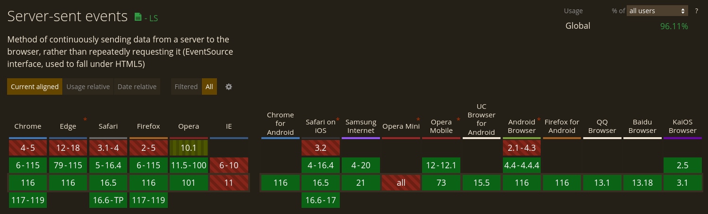

% Server-Sent Events
% tasos@kadena.io
% September 29, 2023
---

# `whoami`

:::::::::::::: {.columns}
::: {.column}

## `whois` Tasos Bitsios

- Developer @ [Kadena](https://kadena.io/) Developer Experience team
- Full stack software developer ~ 13 years
  - Somwehat backend-leaning
  - Mostly JS/TS/node.js/React
  - Mostly worked in startups
  - Mostly harmless
- Socials:
  - [\@Takadenoshi](https://github.com/takadenoshi) on Github 
  - [\@Takadenoshi](https://x.com/takadenoshi) on X

:::
::: {.column}

## `whois` Kadena

- Scalabe PoW Blockchain
  - Focus on intelligent & secure smart contracts
  - TODO
  - TODO
- Socials
  - [\@kadena-io](https://github.com/kadena-io) and [\@kadena-community](https://github.com/kadena-community) on Github
  - [\@kadena_io](https://x.com/kadena_io) on X


:::
::::::::::::::

---

# Server-Sent Events (SSE)

## A server-push protocol

- Unidirectional: Server -> Client
- Essentially a streaming HTTP/1.1 GET (or HTTP/2)
  - Connection is kept open, server writes more data as it becomes available
- (Web) Client side interacts with SSE endpoints using `EventSource`
  - Register `data` or custom `event` callbacks
  - A MessageEvent Interface
- With reconnection batteries included*
  - Terms and conditions may apply
- Very simple protocol

---

# Use cases

Replaces polling.

Stream any kind of update from the server.

- notifications
- live ticker data
- live sports events
- anything that is UTF-8 suitable

---

# What is this ~~new~~ thing?

🥳 SSE is 19 years old

🔧 13 years of mainstream support

<hr />

- 2004 Sep 23 &middot; [Server-sent DOM Events](https://web.archive.org/web/20041009144718/http://www.whatwg.org/specs/web-apps/current-work/#server-sent), Ian Hickson, Opera Software, WHATWG Web Applications 1.0
- 2006 &middot; [Production] Opera browser implementation
- 2009 &middot; [W3C Working Draft](https://www.w3.org/TR/2009/WD-eventsource-20090423/), Ian Hickson, Google Inc
- 2010 Jun &middot; [Production] Safari v5
- 2010 Sep &middot; [Production] Chrome v6, 
- 2011 Aug &middot; [Production] Firefox v6, 
- 2015 Feb &middot; [W3C Recommendation](https://www.w3.org/TR/2015/REC-eventsource-20150203/)

[W3C Publication History](https://www.w3.org/TR/2015/REC-eventsource-20150203/)

<hr />

Current: [HTML Living Standard § 9.2](https://html.spec.whatwg.org/multipage/server-sent-events.html#server-sent-events) 

---

# Playground repo - download me!

:::::::::::::: {.columns}
::: {.column width="60%"}

Play-along repository; basic SSE server & React app:

[https://github.com/takadenoshi/sse-presentation](https://github.com/takadenoshi/sse-presentation)

Useful for examining behaviors, browser implementation differences.

Repo link in QR ➡

:::
::: {.column width="38%"}


:::
::::::::::::::


---

# Minimum Viable SSE response


The simplest server-sent event stream specifies just `data` events.

Example with 2 events:

```
> GET /stream/hello HTTP/1.1

< HTTP/1.1 200 OK
< Content-Type: text/event-stream

< data: Hello\n\n

< data: ReactLive are you there?\n\n
```

Content-Type is `text/event-stream`

Data is encoded in UTF-8 (mandatory)

Events separated by two newline characters `\n\n`

<hr />

<sup>[Playground](https://github.com/takadenoshi/sse-presentation): "simple" scenario</sup>

---

# Simple EventSource consumer

Server-sent events are consumed with `EventSource`:

```
let i=0;

const source = new EventSource("http://localhost:3001/stream/simple");

// "message" event emitted for each "data" event received
source.addEventListener("message", (event) => console.log(++i, event.data), false);

```

The "minimum viable response" from the previous slide would trigger the callback twice, logging:

```
1 Hello
2 ReactLive are you there?
```

---

# Named Events

You can "namespace" your events using the `event:` field with any custom name:

```
< event: goal
< data: "ARS-LIV 1-1 45"\n\n

< event: spectator-chat
< data: "Did you see that ludicrous display just now"\n\n
```

The `goal` and `spectator-chat` events are handled separately on the frontend

Allows multiplexing / routing events without need for pattern matching on the data payload. (e.g. a `.type` field in a JSON object)

---

# Comments

Any lines starting with `:` (colon) are interpreted as comments 

```
< data: this or that\n\n

< :TODO emit some events in the near future
```

These are ignored on the client-side

---

# Reconnection (1)

By default*, EventSource consumers will reconnect if the connection is interrupted.

<sup>\* _with implementation-specific caveats_</sup>

The default reconnection timeout is up to each browser (empirically: between 3-5 s.)

## Custom timeouts

The reconnection timeout can be customized from the server-side by emitting a `retry:` field in any of the events.

```
retry: 2500
data: Hello!\n\n

```

Value is in ms.

Timeouts are linear.

<sup>[Playground](https://github.com/takadenoshi/sse-presentation): "Retry-flaky" scenario</sup>

---

# Reconnection (2)

## Computer can say no

A server can signal "do not reconnect":

- with a `2xx` response other than 200
  - 301, 307 redirects to a 200 are OK
- with a `Content-Type` header other than `text/event-stream`

<sup>[Playground](https://github.com/takadenoshi/sse-presentation): "Not SSE" scenario</sup>

---

# Reconnection (3) - Last-Event-ID

Events can include an `id` field with any UTF-8 string as value.

If the connection is interrupted, the last received ID is sent to the server (header `Last-Event-ID`)

This allows the server to resume from the client's last known message.

<hr />

If this is the last event received in a stream that disconnects:
```
id: data-0
retry: 5000
data: Data Zero event\n\n
```

Then the connection timeout will be 5 seconds, and when reconnecting the `Last-Event-ID` header will be set to `data-0`:

```
> GET /stream/notifications HTTP/1.1
> Host: localhost:3001
> Last-Event-ID: data-0
```

<hr />

<sup>[Playground](https://github.com/takadenoshi/sse-presentation): "notifications" scenario</sup>

---

# Full SSE response

- Unnamed events `data: Hello\n\n`
- Named events `event: status\ndata: some-status-data\n\n`
- Event identifiers `id: some-status-id`
- Setting client reconnection time `retry: 1000`
- Comment: starts with colon `:ping`

:::::::::::::: {.columns}
::: {.column width="60%"}

```
> GET /stream/hello HTTP/1.1

< HTTP/1.1 200 OK
< Content-Type: text/event-stream

< retry: 2000
< id: 0
< data: Hello\n\n

< :I am a comment line\n\n

< id: 1
< event: status
< data: {"L":"warning","M":"Service degraded"}\n\n
```

:::
::: {.column width="40%"}

```


client-side reconnect after 2s


no client-side effect


custom event named "status"


```

:::
::::::::::::::

These 4+1 fields are the entire [SSE grammar](https://www.w3.org/TR/2012/WD-eventsource-20120426/#parsing-an-event-stream)

---

# More EventSource consumer

You can subscribe to custom events (e.g. `status`) with `.addEventListener`:

```
const source = new EventSource('/stream/hello');

// [name]: triggers for custom named event, here: "status"
source.addEventListener(
  "status",
  ({ data }) => console.log("custom event: status", JSON.parse(data)),
  false,
);

// message: on generic/unnamed "data" events, as before
source.addEventListener("message", (event) => { console.log("received data event", event.data); }, false);
```

Subscribe to `open` and `error` for connection management:

```
// open: on connection established
source.addEventListener("open", (event) => { console.log("Connection opened"); }, false);

// error: on error/disconnection. sadly entirely devoid of detail
source.addEventListener("error", (event) => { console.log("Connection error"); }, false);
```

---

# The EventSource Interface

- `constructor(url, { withCredentials: boolean })`
  - `withCredentials`: instantiate with cross-origin (CORS) credentials (default: false)

- Events:
  - `open`: on connection
  - `error`: on error/disconnection
  - `message`: on generic data: event received
  - `<custom>:` on named event received

- `addEventListener("open"|"error"|"message"|<custom: string>, (event: Event) => void, bubbles: bool)`
  - or: `onopen`, `operror`, `onmessage`, ...
  -
- readyState: `CONNECTING` (0) | `OPEN` (1) | `CLOSED`(2)
  - CONNECTING: also "waiting to reconnect"
  - CLOSED: will not attempt to reconnect

- close()

[MDN Reference](https://developer.mozilla.org/en-US/docs/Web/API/EventSource)

---

# Error event is a bit useless

- Single bit of information: "error"

- callback signature is `(event: Event) => void`
  - event.target instanceof EventSource

- No reason or message can be derived 
  - usually output in console

- Some disconnections can be "fatal", cancelling the reconnection policy.

- Inspect `readyState` to find out EventSource's intent:
  - CONNECTING: will reconnect / waiting to reconnect / reconnecting
  - CLOSED: will not reconnect


---

# Implementation Considerations: HTTP/1.1 connections quota

- Browsers implement a **per-hostname connection quota** (6) for HTTP/1.1
- SSE over HTTP/1.1 may hit this easily with multiple tabs open

Per [MDN](https://developer.mozilla.org/en-US/docs/Web/API/Server-sent_events/Using_server-sent_events#listening_for_custom_events):

> Warning: When not used over HTTP/2, SSE suffers from a **limitation to the maximum number of open connections**, which can be especially painful when opening multiple tabs, as the limit is per browser and is set to a very low number (6). The issue has been marked as "Won't fix" in [Chrome](https://bugs.chromium.org/p/chromium/issues/detail?id=275955) and [Firefox](https://bugzilla.mozilla.org/show_bug.cgi?id=906896).

> This limit is per browser + domain, which means that you can open 6 SSE connections across all of the tabs to www.example1.com and another 6 SSE connections to www.example2.com (per Stackoverflow).

> When using HTTP/2, the maximum number of simultaneous HTTP streams is negotiated between the server and the client (defaults to 100).

<hr />

## Solutions

- **Prefer HTTP/2 where available** (can-i-use 96% yes)
- If applicable, use an EventSource within a SharedWorker
  - shared by all tabs
- Use a subdomain for SSE endpoint(s)

---

# Implementation Considerations: Reconnecting

**Default reconnection behavior implementation is not fully standardized**

- Firefox: Will stop retrying when it encounters network errors (standard compliant)
- Chrome: Will keep retrying when it encounters network errors (actually helpful)

**Consider handling reconnections yourself:**

- Option for exponential backoff strategies
- Better connection timeout detection

<hr />

Test it out in the [playground repo](https://github.com/takadenoshi/sse-presentation):

- Start server & react-app
- Open react-app on Firefox
- Connect to any endpoint
- Stop the server
- Firefox will attempt to reconnect once, encounter a network error, then stop
  - Chrome will instead keep reconnecting

---

# Implementation Considerations: Proxies (1)

## Proxies can kill

Proxies, load balancers and other networking middleware can kill idle connections after a short while.

<hr />

Two approaches to fix this:

## 1/ Comment (not client-aware)

You can emit a comment (any line starting with a colon `:`)

```
< :bump
```

Good enough to keep connection alive.

EventSource won't emit any event.

---

# Implementation Considerations: Proxies (2)

## Proxies can kill

Proxies, load balancers and other networking middleware can kill idle connections after a short while.

<hr />

Two approaches to fix this:

## 2/ Heartbeat event (client-aware)

Emit a custom "heartbeat" or "ping" event every 15 seconds or so:

```
event: heartbeat
data: ""
```

(data field **must** be present)

The client can listen to this event and use it to detect stale connections:

**"expect heartbeats every N seconds, otherwise reconnect"**

Preferred approach, especially for important payloads.

---

# Implementation Considerations: Service Workers (Firefox)

## Firefox Service Workers 💔 EventSource

Firefox has yet to implement support for EventSource in its Service Worker context.

✅ You can use it in a SharedWorker

Future people can track the present validity of this statement [here](https://bugzilla.mozilla.org/show_bug.cgi?id=1681218).

---

# Implementation Considerations: Last-Event-ID detail

**If no event is emitted in the subsequent connection's lifetime, the Last-Event-ID is reset.**

When a reconnected session is initialized with `Last-Event-ID: X`

And the connection emits no messages for its lifetime,

Then the Last-Event-ID value is _reset_.

---

# Vs competiting options

Widely supported options for polling/streaming updates:

:::::::::::::: {.columns}
::: {.column width="33%"}

## 1a/ Polling

Keep requesting new data on an interval

- Slower
- Usually more resource intensive than SSE

Benefit: Doesn't "hog" a connection (HTTP/1.1)

## 1b/ Long Polling

"Hanging GET" - server keeps connection open/hanging until there is something to write.

Client loops the GET request.

:::
::: {.column width="32%"}

## 2/ SSE

- Like formalized, reusable long polling
- HTTP + REST compatible
  - Works with your existing framework
  - Works with your existing auth
- Reconnecting

:::
::: {.column width="32%"}

## 3/ Websockets

- Not HTTP/REST
  - Websocket server usually a separate stack inside/beside your main backend
- Must bring your own:
  - Routing
  - Auth
  - Error handling
  - TLS Certs (duplicated)
- Pain to debug
- Bidirectional/full duplex
  - good if you need it
  - overkill for 

:::
::::::::::::::

---

# Can I use?

Yes (96.11%)



[https://caniuse.com/eventsource](https://caniuse.com/eventsource)

---

# References

[§ 9.1 MessageEvent Interface - HTML Living Standard](https://html.spec.whatwg.org/multipage/comms.html)

[§ 9.2 Server-Sent Events - HTML Living Standard](https://html.spec.whatwg.org/multipage/server-sent-events.html#server-sent-events)

[This presentation & accompanying playground - Github](https://github.com/takadenoshi/sse-presentation)
